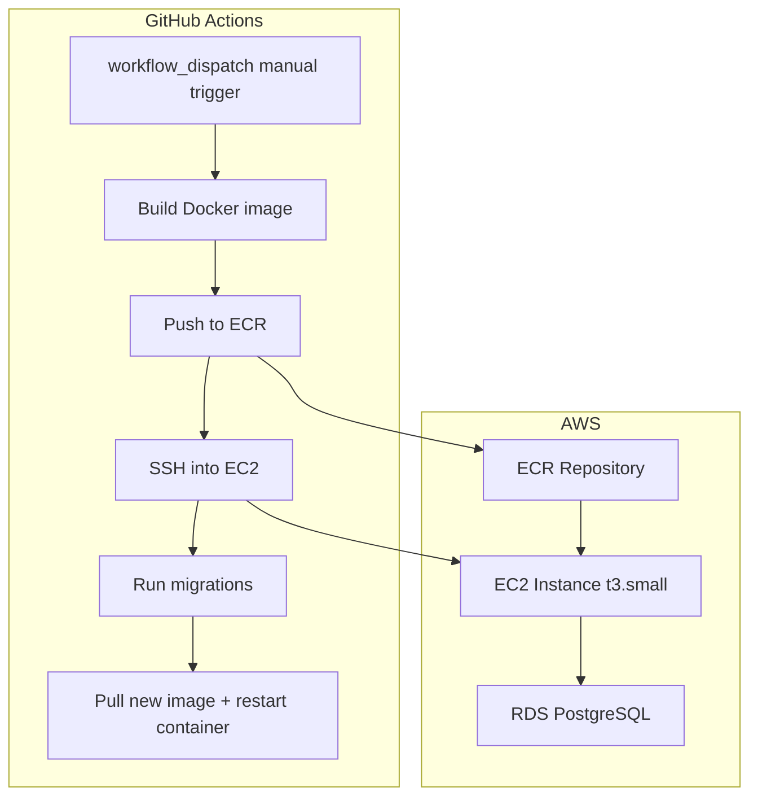

# EC2 Production Deploy Plan

## Architecture Overview




---

## Phase 1: Terraform Infrastructure (`infra/`)

New directory `infra/` at repo root with these files:

- `**main.tf**` — AWS provider config, backend state (S3 bucket)
- `**ecr.tf**` — ECR repo `work-from-car-server`
- `**rds.tf**` — RDS PostgreSQL 15, private subnet, no public access
- `**ec2.tf**` — EC2 t3.small, Amazon Linux 2023, user-data to install Docker + ECR login cron
- `**iam.tf**` — OIDC provider for GitHub Actions (no long-lived keys), plus EC2 instance profile to pull from ECR
- `**sg.tf**` — Security group: port 3000 open (or behind ALB), EC2→RDS on 5432 only
- `**variables.tf**` / `**outputs.tf**` — EC2 IP, RDS endpoint, ECR URL as outputs

> OIDC is preferred over long-lived `AWS_ACCESS_KEY_ID`/`AWS_SECRET_ACCESS_KEY` (Xavier's pattern), consistent with modern GHA best practices.

---

## Phase 2: Server Changes

### 2a. Replace `server/Dockerfile`

Current `server/Dockerfile` points to `mysql:8` — completely mismatched. Replace with a proper multi-stage Node.js build:

```dockerfile
# Build stage
FROM node:20-alpine AS builder
WORKDIR /app
COPY package*.json ./
RUN npm ci
COPY . .
RUN npm run build

# Runtime stage
FROM node:20-alpine
WORKDIR /app
COPY package*.json ./
RUN npm ci --omit=dev
COPY --from=builder /app/build ./build
COPY migrations ./migrations
CMD ["node", "build/api/server.js"]
```

### 2b. Add scripts to `server/package.json`

Currently missing `build` and `start`:

```json
"build": "tsc",
"start": "node build/api/server.js",
"migrate": "node build/setupScripts/migrate.js"
```

### 2c. SSL for Postgres (`server/src/api/Db.ts`, migrate runner)

Use `POSTGRES_SSL=true` for RDS; omit or `false` for local. When true, `ssl: { rejectUnauthorized: false }`; when false, `ssl: false`.

### 2d. Create `server/migrations/` directory

Move `initdb/init.sql` content into:

- `server/migrations/001_init_accounts.sql`

Future migrations follow: `002_...sql`, `003_...sql`.

### 2e. Create `server/src/setupScripts/migrate.ts`

Simple migration runner script:

- Creates `schema_migrations(filename, applied_at)` table if not exists
- Reads `migrations/*.sql` files sorted alphabetically
- Skips already-applied ones (by filename)
- Runs new ones in order, records them in the tracking table

---

## Phase 3: GitHub Actions Workflow (`.github/workflows/deploy.yml`)

Modeled after `newworld_production.yml`. Key steps:

```yaml
name: "Deploy: Production"
on:
  workflow_dispatch:

jobs:
  build:
    environment: production        # GHA environment protection gate
    steps:
      - Checkout
      - Configure AWS credentials (OIDC)
      - Login to ECR
      - docker build -f server/Dockerfile -t $ECR_REGISTRY/work-from-car-server:$SHA
      - docker push --all-tags

  deploy:
    needs: build
    steps:
      - SSH into EC2 (via appleboy/ssh-action or direct ssh)
      - Run migrations:
          docker run --rm --env-file /etc/server.env $IMAGE node build/setupScripts/migrate.js
      - Replace running container:
          docker stop server || true
          docker rm server || true
          docker run -d --name server --env-file /etc/server.env -p 3000:3000 $IMAGE
```

### GHA Secrets needed

- `AWS_ROLE_ARN` (OIDC) or `AWS_ACCESS_KEY_ID` + `AWS_SECRET_ACCESS_KEY`
- `EC2_SSH_KEY` — private key for SSH
- `EC2_HOST` — EC2 public IP
- `SERVER_ENV` — contents of `.env` to write to `/etc/server.env` on EC2

---

## Phase 4: EC2 Bootstrap

On first provision, user-data script on the EC2 instance will:

1. Install Docker
2. `aws ecr get-login-password` → `docker login` (via instance profile)
3. Write `/etc/server.env` from the initial env values (seeded once manually or via SSM Parameter Store)

---

## Files Created / Modified


| File                                                                                           | Action                                  |
| ---------------------------------------------------------------------------------------------- | --------------------------------------- |
| `infra/main.tf`, `ecr.tf`, `rds.tf`, `ec2.tf`, `iam.tf`, `sg.tf`, `variables.tf`, `outputs.tf` | Create                                  |
| `server/Dockerfile`                                                                            | Replace (MySQL → Node.js)               |
| `server/package.json`                                                                          | Add `build`, `start`, `migrate` scripts |
| `server/src/api/Db.ts`                                                                         | `POSTGRES_SSL` + pg `ssl` option        |
| `server/migrations/001_init_accounts.sql`                                                      | Create (from initdb/init.sql)           |
| `server/src/setupScripts/migrate.ts`                                                           | Create                                  |
| `.github/workflows/deploy.yml`                                                                 | Create                                  |


