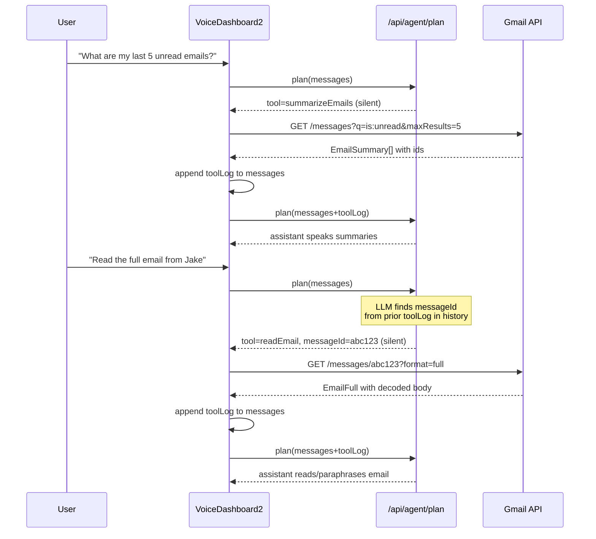

# `gmail.readEmail` Tool

## The Target Flow

```
User: "What are my last 5 unread emails?"
  → gmail.summarizeEmails (silent) → returns list with id, from, subject, snippet
Agent: "You have 5 unread emails. One from Jake about the Q3 report, one from Sarah about the team lunch..."

User: "Read the full email from Jake"
  → gmail.readEmail (silent, messageId resolved from prior summarize result)
Agent: "Jake's email says: Hi, just wanted to follow up on the Q3 report..."
```

The key insight: the LLM already has the `summarizeEmails` results in its conversation history (injected as a system message via `toolLog`). It can pick the correct `messageId` from that context when the user refers to an email by sender/subject.

## What Needs to Be Built

### 1. Gmail API function -- `app/src/api/readEmail.ts` (new file) -- D

Calls `GET /gmail/v1/users/me/messages/{messageId}?format=full`, parses the body (handles both `text/plain` parts and base64url-encoded payloads), and returns:

```typescript
export interface EmailFull {
  id: string;
  threadId: string;
  from: string;
  subject: string;
  date: string;
  body: string; // plain text, decoded and trimmed
}
```

The Gmail API returns body as base64url-encoded parts. Needs decoding with `atob` / `Buffer.from(str, 'base64url')`. Should strip excessive whitespace and truncate to a reasonable limit (~3000 chars) so TTS doesn't read forever.

### 2. Tool schema -- add to `app/src/api/toolSchemas/email.ts -- D`

```typescript
export const readEmailParametersSchema = z.object({
  messageId: z.string(),
});
```

### 3. Tool executor -- add case to `app/src/api/toolExecutor.ts`

```typescript
case 'gmail.readEmail': {
  const params = readEmailParametersSchema.parse(tool.toolParameters);
  const result = await readEmail(params.messageId, accessToken);
  return { tool: tool.tool, status: 'success', result };
}
```

### 4. Server tool spec -- `server/src/api/Agent/tools/gmail/EmailRead.ts` (new file)

Follows the same pattern as `EmailSummarize.ts` -- a Zod schema + LLM instructions string:

- Tool name: `"gmail.readEmail"`
- Parameter: `messageId: string` -- the `id` field from a prior `summarizeEmails` result
- LLM instructions need to make clear:
  - Only use this when the user wants to read a specific email's full content
  - `messageId` must come from a prior `summarizeEmails` result in the conversation -- never invent one
  - After receiving the body, read it out naturally, paraphrasing long content

### 5. Register in `server/src/api/Agent/utils/AgentToolSpec.ts`

Import `EMAIL_READ_INSTRUCTIONS` and add to `ALL_TOOLS_DESCRIPTION`.

### 6. Mark as silent -- `server/src/api/Agent/utils/isSilent.ts`

Add `"gmail.readEmail"` to the silent cases. Read-only, no confirmation needed.

## Conversation Context -- How the LLM Picks the Right Email

The `summarizeEmails` result is injected into `messages` as a system message containing the full `ToolExecutionLog` JSON (this already happens in `VoiceDashboard2.tsx` line 144):

```typescript
currentMessages = [...currentMessages, { role: 'system', content: JSON.stringify(toolLog) }];
```

The `toolLog.result` contains the `EmailSummary[]` array with `id`, `from`, `subject`, `snippet`. When the user says "read the one from Jake", the LLM sees that prior system message and can select the correct `messageId`. The LLM instructions for `readEmail` should explicitly say to look for `messageId` in prior `gmail.summarizeEmails` results in the conversation history.

## Flow Diagram




## Files Changed

- `app/src/api/readEmail.ts` -- new, Gmail API call + base64 decode
- `app/src/api/toolSchemas/email.ts` -- add `readEmailParametersSchema`
- `app/src/api/toolExecutor.ts` -- add `gmail.readEmail` case
- `server/src/api/Agent/tools/gmail/EmailRead.ts` -- new, tool spec + LLM instructions
- `server/src/api/Agent/utils/AgentToolSpec.ts` -- register `EMAIL_READ_INSTRUCTIONS`
- `server/src/api/Agent/utils/isSilent.ts` -- add `gmail.readEmail` as silent

No changes needed to `VoiceDashboard2.tsx` or the agent route handlers -- the silent tool loop already handles this correctly.