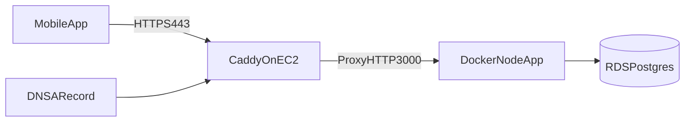

# Move Production API To HTTPS

## Goal
Serve the backend at `https://api.workfromcar.xyz` from the existing EC2 instance, proxying to the Dockerized Node app on port `3000`, so the iOS app no longer depends on raw-IP HTTP.

## Current Repo State
- The app currently uses `API_BASE_URL=http://13.221.130.176:3000` in [/Users/aceroliang/SAAS/work_from_car/app/.env](/Users/aceroliang/SAAS/work_from_car/app/.env).
- The iOS ATS exception has already been removed from [/Users/aceroliang/SAAS/work_from_car/app/ios/WorkFromCar/Info.plist](/Users/aceroliang/SAAS/work_from_car/app/ios/WorkFromCar/Info.plist), so the app now needs HTTPS to work on iOS.
- The server listens on plain HTTP port `3000` in [/Users/aceroliang/SAAS/work_from_car/server/src/api/server.ts](/Users/aceroliang/SAAS/work_from_car/server/src/api/server.ts).
- Deployment publishes the container directly on `3000` in [/Users/aceroliang/SAAS/work_from_car/.github/workflows/deploy.yml](/Users/aceroliang/SAAS/work_from_car/.github/workflows/deploy.yml).
- Terraform currently exposes EC2 port `3000` publicly in [/Users/aceroliang/SAAS/work_from_car/infra/sg.tf](/Users/aceroliang/SAAS/work_from_car/infra/sg.tf).
- DNS has been created for `api.workfromcar.xyz` pointing at the EC2 public IP.

## Proposed Architecture


## Implementation Plan
1. Add a real API hostname.
- Completed: `api.workfromcar.xyz` now points to the EC2 public IP with an `A` record.
- Keep this hostname stable so the mobile app and any OAuth/backend callbacks stop depending on the raw IP.

2. Install and configure Caddy on the EC2 instance.
- SSH into the EC2 instance as `ec2-user`.
- Install Caddy on Amazon Linux 2023 with:

  ```bash
  sudo dnf install -y caddy
  ```

- If the package is unavailable on the instance, use the static binary fallback:

  ```bash
  curl -L -o caddy.tar.gz "https://github.com/caddyserver/caddy/releases/latest/download/caddy_$(uname -m | sed 's/x86_64/linux_amd64/;s/aarch64/linux_arm64/').tar.gz"
  tar xvf caddy.tar.gz
  sudo mv caddy /usr/bin/
  caddy version
  ```

- Create `/etc/caddy/Caddyfile` with:

  ```caddyfile
  api.workfromcar.xyz {
    encode gzip zstd
    reverse_proxy 127.0.0.1:3000
  }
  ```

- Start and enable Caddy:

  ```bash
  sudo systemctl enable --now caddy
  sudo systemctl status caddy
  ```

- After the file exists, validate and reload the config:

  ```bash
  sudo caddy validate --config /etc/caddy/Caddyfile
  sudo systemctl reload caddy
  ```

- Confirm Caddy obtained a certificate by checking:

  ```bash
  curl -I https://api.workfromcar.xyz
  sudo journalctl -u caddy --no-pager | tail -100
  ```

- Persist this setup in infrastructure after it works manually. Prefer adding Caddy installation/bootstrap to EC2 `user_data` in [/Users/aceroliang/SAAS/work_from_car/infra/ec2.tf](/Users/aceroliang/SAAS/work_from_car/infra/ec2.tf), while keeping app rollout logic in [/Users/aceroliang/SAAS/work_from_car/.github/workflows/deploy.yml](/Users/aceroliang/SAAS/work_from_car/.github/workflows/deploy.yml).

3. Tighten network exposure.
- Update [/Users/aceroliang/SAAS/work_from_car/infra/sg.tf](/Users/aceroliang/SAAS/work_from_car/infra/sg.tf) so ports `80` and `443` are public.
- Remove public access to port `3000` once Caddy is proxying locally.
- Optionally restrict SSH to a known IP range instead of `0.0.0.0/0` while touching security groups.

4. Adjust container runtime assumptions.
- Keep the Node server on HTTP internally at port `3000`; no TLS changes are needed in [/Users/aceroliang/SAAS/work_from_car/server/src/api/server.ts](/Users/aceroliang/SAAS/work_from_car/server/src/api/server.ts) beyond optionally making the port configurable.
- Update the deploy workflow so the app remains reachable to Caddy while avoiding unnecessary public exposure of `3000`. The target end state is Docker bound to localhost (`127.0.0.1:3000:3000`) instead of all interfaces.

5. Switch the mobile app to the HTTPS domain.
- Change `API_BASE_URL` in [/Users/aceroliang/SAAS/work_from_car/app/.env](/Users/aceroliang/SAAS/work_from_car/app/.env) from the raw IP URL to `https://api.workfromcar.xyz`.
- Verify all app requests already flow through `API_BASE_URL` via [/Users/aceroliang/SAAS/work_from_car/app/src/utils/utils.ts](/Users/aceroliang/SAAS/work_from_car/app/src/utils/utils.ts), so no broad JS refactor should be needed.

6. Remove the iOS ATS exception.
- Completed: the `NSExceptionDomains` entry for `13.221.130.176` has already been removed from [/Users/aceroliang/SAAS/work_from_car/app/ios/WorkFromCar/Info.plist](/Users/aceroliang/SAAS/work_from_car/app/ios/WorkFromCar/Info.plist).
- Keep `NSAllowsArbitraryLoads` disabled.
- Re-test the app on iOS against the HTTPS domain to confirm ATS passes without special exceptions.

7. Validate production behavior end to end.
- Confirm DNS resolves to the EC2 host.
- Confirm Caddy provisions a valid certificate and `https://api.<your-domain>` responds successfully.
- Verify app auth and API requests succeed from iOS without ATS warnings.
- Check whether any external service configuration, such as Google OAuth redirect/origin settings, needs the new domain even if the app code itself does not.

## First Manual Bring-Up
Use this order the first time so Caddy has the best chance of issuing the certificate cleanly:

1. Confirm DNS resolves:

   ```bash
   nslookup api.workfromcar.xyz
   ```

2. Open EC2 security group ports `80` and `443` to the internet.
3. SSH into the server and install Caddy.
4. Create the `Caddyfile`.
5. Start Caddy and confirm `https://api.workfromcar.xyz` responds.
6. Only after HTTPS works, update [/Users/aceroliang/SAAS/work_from_car/app/.env](/Users/aceroliang/SAAS/work_from_car/app/.env) to the HTTPS URL.
7. Rebuild the iOS app and test an API call.

## Expected File Touches
- [/Users/aceroliang/SAAS/work_from_car/infra/ec2.tf](/Users/aceroliang/SAAS/work_from_car/infra/ec2.tf)
- [/Users/aceroliang/SAAS/work_from_car/infra/sg.tf](/Users/aceroliang/SAAS/work_from_car/infra/sg.tf)
- [/Users/aceroliang/SAAS/work_from_car/.github/workflows/deploy.yml](/Users/aceroliang/SAAS/work_from_car/.github/workflows/deploy.yml)
- [/Users/aceroliang/SAAS/work_from_car/app/.env](/Users/aceroliang/SAAS/work_from_car/app/.env)
- [/Users/aceroliang/SAAS/work_from_car/app/ios/WorkFromCar/Info.plist](/Users/aceroliang/SAAS/work_from_car/app/ios/WorkFromCar/Info.plist)
- Possibly [/Users/aceroliang/SAAS/work_from_car/server/src/api/server.ts](/Users/aceroliang/SAAS/work_from_car/server/src/api/server.ts) if port configuration is cleaned up.

## Notes
- This keeps latency low because TLS termination happens on the same EC2 host rather than adding an AWS load balancer hop.
- This is cheaper than adding ALB + ACM, but it makes TLS and reverse-proxy setup part of your EC2/server management responsibilities.
- The most important non-code prerequisite is owning a domain/subdomain that can point at the instance.