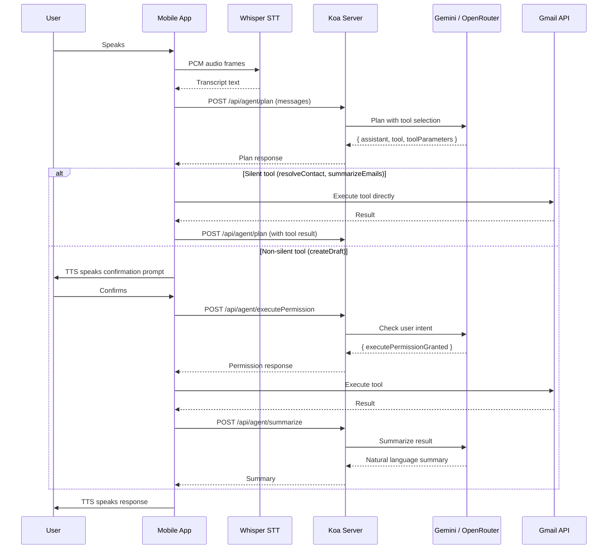

# WorkFromCar -- Codebase Reference

## What It Is

A **voice-first AI assistant** iOS app for hands-free email management while driving. The user speaks naturally, the app transcribes speech on-device, sends it to a server-side LLM agent that plans actions (draft emails, search inbox, resolve contacts), and speaks the result back via TTS.

## Tech Stack

- **Mobile:** React Native 0.83 (iOS only for voice), React 19, TypeScript
- **Backend:** Node.js + Koa, TypeScript, PostgreSQL 16 (Docker)
- **LLMs:** Google Gemini (`gemini-3.1-flash-lite-preview`) for planning/summarization, OpenRouter (`openai/gpt-oss-120b`) for intent confirmation
- **Voice:** whisper.cpp (on-device STT + VAD), Kokoro/Sherpa-ONNX (on-device TTS), Picovoice mic capture
- **Auth:** Google Sign-In (OAuth), JWT for API auth
- **APIs:** Gmail API, Google People API (both called from client with user's OAuth token)

## Monorepo Structure

```
work_from_car/
├── app/                          # React Native mobile app
│   ├── src/
│   │   ├── api/                  # Gmail/People API calls, tool executor, tool schemas
│   │   ├── components/           # VoiceListener, AudioVisualizer, icons
│   │   ├── context/              # AccessTokenContext
│   │   ├── navigation/           # RootNavigator (Login or VoiceDashboard)
│   │   ├── screens/              # Login, VoiceDashboard2 (main)
│   │   ├── services/audio/       # voiceProcessor (mic setup)
│   │   └── utils/                # fetchUtils, useSendMessage, ttsUtils
│   └── ios/third_party/whisper.cpp  # Git submodule
├── server/                       # Koa backend
│   ├── src/api/
│   │   ├── Agent/                # LLM agent (routes, actions, tools, utils)
│   │   ├── Auth/                 # Google login + JWT
│   │   └── Account/              # AccountDb (PostgreSQL)
│   └── initdb/init.sql           # DB schema (accounts table)
├── packages/
│   ├── whisper/                  # Native TurboModule for Whisper STT + VAD
│   └── kokoro/                   # Native TurboModule for Kokoro TTS
├── types/Agent/index.d.ts        # Shared Agent types (Message, PlanState, ToolLog)
└── site/                         # Static dev/test pages
```

## Core User Flow




## Server API Endpoints

- `POST /api/auth/google` -- Exchange Google `idToken` for JWT + upsert account
- `POST /api/agent/plan` -- LLM generates a plan (tool + params) from conversation messages
- `POST /api/agent/executePermission` -- Validates tool params + checks user intent via LLM
- `POST /api/agent/summarize` -- Summarizes tool execution result into spoken sentence

## Agent Tools

- `**gmail.createDraft**` -- Compose and send email (to, subject, body). Non-silent; requires user confirmation.
- `**gmail.summarizeEmails**` -- List and summarize inbox (query, maxResults). Silent; auto-executes.
- `**gmail.resolveContact**` -- Resolve contact name to email (value). Silent; auto-executes. Uses edit distance + phonetic scoring.

## Key Files Quick Reference

**Mobile App:**

- [app/src/screens/VoiceDashboard2.tsx](app/src/screens/VoiceDashboard2.tsx) -- Main voice assistant screen
- [app/src/components/VoiceListener.tsx](app/src/components/VoiceListener.tsx) -- VAD + Whisper STT pipeline
- [app/src/api/toolExecutor.ts](app/src/api/toolExecutor.ts) -- Dispatches tool calls to Gmail/People APIs
- [app/src/api/toolSchemas/email.ts](app/src/api/toolSchemas/email.ts) -- Zod schemas for tool parameters
- [app/src/utils/useSendMessage.ts](app/src/utils/useSendMessage.ts) -- `sendAgentMessage()` and `callSummarize()`
- [app/src/api/auth.ts](app/src/api/auth.ts) -- Google Sign-In + JWT storage
- [app/src/navigation/RootNavigator.tsx](app/src/navigation/RootNavigator.tsx) -- Auth-gated navigation

**Server:**

- [server/src/api/Agent/actions/PlanActions.ts](server/src/api/Agent/actions/PlanActions.ts) -- LLM plan generation with retry + JSON repair
- [server/src/api/Agent/actions/ExecutePermissionsActions.ts](server/src/api/Agent/actions/ExecutePermissionsActions.ts) -- Tool validation + intent check + summarization
- [server/src/api/Agent/utils/LMProviders.ts](server/src/api/Agent/utils/LMProviders.ts) -- Gemini and OpenRouter clients
- [server/src/api/Agent/utils/PlanInstructions.ts](server/src/api/Agent/utils/PlanInstructions.ts) -- System prompt and JSON schema for planning
- [server/src/api/Agent/routes/AgentRouter.ts](server/src/api/Agent/routes/AgentRouter.ts) -- Agent route definitions
- [server/src/api/Auth/routes/AuthRoutes.ts](server/src/api/Auth/routes/AuthRoutes.ts) -- Auth handlers

**Shared:**

- [types/Agent/index.d.ts](types/Agent/index.d.ts) -- Shared TypeScript types (Message, PlanState, ToolLog)

**Native Modules:**

- [packages/whisper/](packages/whisper/) -- Whisper.cpp TurboModule (loadModel, pcmBufferToText, vadProcessBuffer)
- [packages/kokoro/](packages/kokoro/) -- Kokoro TTS TurboModule (loadModel, speak, stop)

## Database

Single `accounts` table in PostgreSQL: `id`, `email`, `google_sub`, `created_at`. Upsert on Google login.

## Dev Setup

- **DB:** `make run-db` (PostgreSQL 16 in Docker, initialized by `server/initdb/init.sql`)
- **Server:** `make run-server` (tsc --watch + nodemon)
- **App:** `npx react-native run-ios`
- **Env files:** `app/.env` (API_BASE_URL, GOOGLE_WEB_CLIENT_ID) and `server/.env` (GEMINI_API_KEY, OPEN_ROUTER_API_KEY, JWT_SECRET, DB creds)

## Architecture Notes

- The server is a **pure planning layer** -- it never calls Gmail or People APIs directly. All external API calls happen on the client using the user's OAuth access token.
- Voice processing (STT + TTS) is entirely on-device via native modules, keeping latency low for in-car use.
- "Silent" tools auto-execute without user confirmation; "non-silent" tools (like sending email) require explicit spoken confirmation, checked by a separate LLM call.
- Plan generation uses `jsonrepair` + Zod validation with up to 3 retries to handle LLM output inconsistencies.

